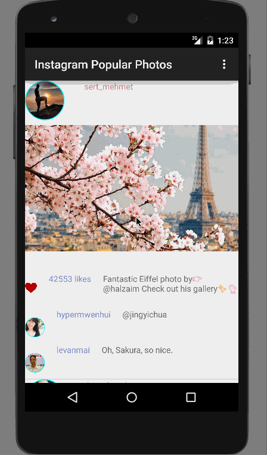

# AndroidAppDemo

(Picasa App README)

This is an Android application to view popular photos in picasa

Time spent: 8 hours spent in total

Completed user stories:

 * [x] Required: User can scroll through current popular photos from Instagram.
 * [x] Required: For each photo displayed, user can see Graphic, Caption, Username
 * [x] Optional: For each photo displayed, user can see the like count, user profile image
 * [x] Optional: Add pull-to-refresh for popular stream with SwipeRefreshLayout 
 * [x] Optional: Show latest two comment for each photo 
 * [x] Optional: Display each user profile image using a RoundedImageView 

Notes:

GIF created with [LiceCap](http://www.cockos.com/licecap/).
